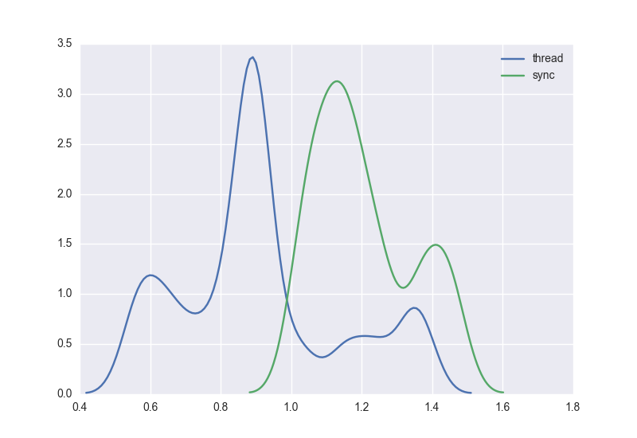
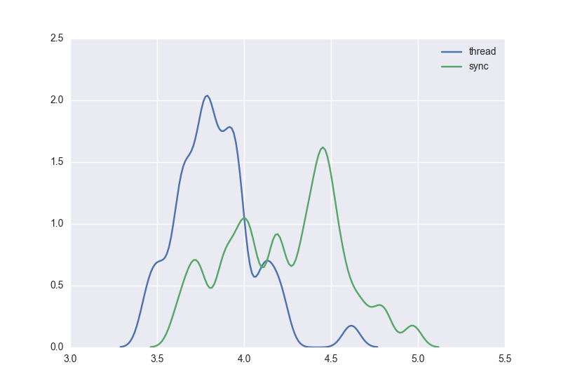
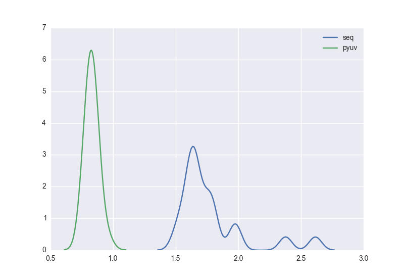
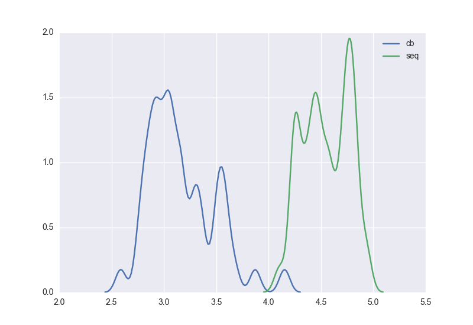

# concurrentfun
Scripts attempting to efficiently schedule disk io and cpu in one process

# Threading vs the GIL

Can we beat the performance of sequential code?

### Factorial Task

### MD5s Task

# Without using stdlib io module?

Can use `libuv`, the cross platform asynchronous IO library that backs, among other things, node.js

### Factorial Task

### MD5s Task

